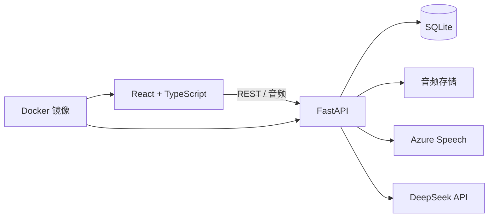
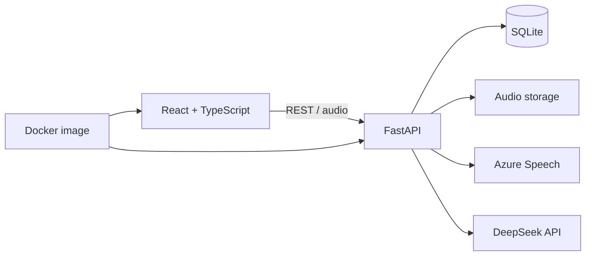

# TOEFL AI Trainer

[中文](#中文) · [English](#english)

## 中文

一个结合浏览器录音、语音评测、AI 反馈和学习记录的托福口语与阅读训练应用。

[**在线演示**](https://toefl-listen-repeat.onrender.com/) · [架构说明](docs/ARCHITECTURE.md) · [部署说明](docs/DEPLOYMENT.md)

使用 React、TypeScript、FastAPI、SQLite、Azure Speech、DeepSeek 和 Docker 构建。

演示部署采用公开访问模式，并使用共享的第三方 API 额度；AI 功能可能受到额度限制。运行状态以实际访问为准。

### 为什么做这个项目

把一次练习串成可以复盘的过程：作答、评测、查看反馈、保存记录，再根据历史表现安排回练。项目将浏览器音频采集、云端语音服务、AI 反馈与持久化记录连接在同一个 Web 应用中。

这是独立训练项目，与 ETS 无隶属或认可关系，评测结果也不是官方托福分数。

### 主要功能

| 模块 | 用途 |
| --- | --- |
| 听后复述 | 录制复述，调用 Azure 发音评测，整理词级发音、流利度、完整度和韵律诊断 |
| 口语面试 | 围绕一个场景完成四道问题，转写录音，提供 DeepSeek 结构化反馈与参考答案 |
| 阅读练习 | 完成短篇阅读题组，查看作答反馈与技能分类统计 |
| 自适应阅读模拟 | 根据第一模块表现进入 Upper 或 Lower 第二模块，形成 50 题训练路径；属于本项目的模拟规则 |
| 学习记录与复习 | 保存作答、诊断和音频引用，从历史记录整理薄弱单词、音素与回练队列 |

### 架构



生产容器构建前端，并由 FastAPI 同时提供前端页面和 API。仓库提供 Render 部署配置，使用 HTTPS、持久化存储与服务端环境变量。

### 可以从代码中查看的工程实践

- API 密钥放在服务端，配置与代码分离。
- 同时保留服务原始响应与标准化诊断，便于追溯和排查。
- 线上演示与个人本地练习数据分开管理。
- 可选的密码访问控制使用 HttpOnly 会话 Cookie；演示配置采用公开访问模式。
- 前后端打包成单个 Docker 服务，持久数据使用 `/data` 挂载。
- 听后复述、阅读和口语面试题库分别提供内容检查脚本。

这些是当前实现与配置说明。构建和内容检查不能代替语音、AI 反馈或线上部署的端到端验证。

### 隐私与本地数据

仓库排除 API 密钥、访问密码、会话密钥、个人练习数据库与录音，以及生成音频、本地日志和机器专用配置。`.env.example` 是配置模板，填写后的 `.env` 应留在本地。

### 本地运行

需要 Python 3.11+、Node.js 20+。发音评测需要 Azure Speech 凭据；DeepSeek 凭据用于可选的 AI 面试反馈。

```bash
git clone https://github.com/desperado74/toefl-listen-repeat.git
cd toefl-listen-repeat

python3 -m venv .venv
source .venv/bin/activate
pip install -r backend/requirements.txt

cp .env.example .env
npm install
npm --prefix frontend install
npm run dev
```

根据需要在 `.env` 中填写服务配置。打开终端中 Vite 给出的地址，默认通常是 `http://127.0.0.1:5173`；如果该端口被占用，端口可能变化。已有 Mac 启动脚本默认使用 5174，与上述 `npm run dev` 的默认入口不同。

### 检查

```bash
python data/tools/validate_listen_repeat_bank.py
python data/tools/validate_interview_bank.py
python data/tools/validate_reading_bank.py
npm --prefix frontend run build
python -m compileall backend/app
```

### 部署与目录

`Dockerfile` 构建包含前后端的单个服务，`render.yaml` 定义托管服务、健康检查和持久化路径。部署所需的密钥在托管平台配置。详见 [部署说明](docs/DEPLOYMENT.md)。

| 目录或文件 | 职责 |
| --- | --- |
| `backend/` | FastAPI 应用、持久化与评测逻辑 |
| `frontend/` | React 与 TypeScript 客户端 |
| `data/` | 原创训练内容与题库检查工具 |
| `docs/` | 架构、部署与内容规范 |
| `scripts/` | 本地开发辅助脚本 |
| `Dockerfile`、`render.yaml` | 容器构建与托管配置 |

### 当前限制

- 在线演示使用共享 API 额度，功能可用性可能随额度变化。
- AI 反馈与自适应路径用于训练，不能当作官方评分或官方自适应算法。
- 当前 SQLite 方案服务于单服务演示；面向多用户的正式产品仍需完善账号、存储和限流设计。
- 构建和题库检查验证本地文件与代码；语音评测、AI 反馈和线上可用性需要另行实测。
- README 已提供中英介绍，辅助文档保留原有语言；界面目前主要使用中文。

## English

> A deployed full-stack AI learning application that turns speaking and reading practice into immediate feedback, persisted learning history and targeted review signals.

[**Try the live demo**](https://toefl-listen-repeat.onrender.com/) · [Architecture](docs/ARCHITECTURE.md) · [Deployment notes](docs/DEPLOYMENT.md)

Built with React, TypeScript, FastAPI, SQLite, Azure Speech, DeepSeek and Docker.

> The public demo opens without a shared password. It uses shared third-party API quotas, so AI-intensive features may be temporarily limited.

### Overview

TOEFL AI Trainer is designed around a complete practice loop: attempt, evaluate, review and reinforce. It combines browser audio recording, cloud speech assessment, AI-generated feedback and persistent learning history in one deployable service.

This is an independent training project. It is not affiliated with, endorsed by or an official scoring product of ETS.

### Features

| Module | What it does |
| --- | --- |
| Listen & Repeat | Records spoken responses, requests Azure pronunciation assessment and returns word-level pronunciation, fluency, completeness and prosody diagnostics. |
| Speaking Interview | Guides learners through a four-question interview, transcribes audio and generates structured DeepSeek feedback and reference answers. |
| Reading Practice | Provides short reading sets with answer review and skill-level summaries. |
| Adaptive Reading Simulation | Routes a learner to an Upper or Lower second module from first-module performance, producing a 50-item training path. This is a local simulation, not the official ETS adaptive algorithm. |
| Learning Analytics | Persists attempts, normalized diagnostics and audio references, then builds weak-word, phoneme and review queues from practice history. |

### Architecture



The production container builds the React frontend and serves it together with the FastAPI API. Render provides HTTPS, persistent storage and server-side environment variables.

### What This Project Demonstrates

- Kept API credentials server-side and separated configuration from source code.
- Preserved raw provider responses alongside normalized diagnostics for traceability and debugging.
- Isolated hosted demo data from personal local practice data.
- Implemented optional password-gated access with an HttpOnly session cookie; the portfolio deployment runs in public-demo mode.
- Packaged frontend and backend as one Docker service with a persistent `/data` mount.
- Added content validators for Listen & Repeat, Reading and Speaking Interview banks.

### Privacy and Security

The repository intentionally excludes:

- API keys, access passwords and session secrets;
- personal practice databases and recordings;
- generated audio and local logs;
- machine-specific configuration.

Use `.env.example` only as a configuration template. Never commit a populated `.env` file.

### Run Locally

#### Prerequisites

- Python 3.11+
- Node.js 20+
- Azure Speech credentials for pronunciation assessment
- DeepSeek API credentials for AI interview feedback (optional)

#### Setup

```bash
git clone https://github.com/desperado74/toefl-listen-repeat.git
cd toefl-listen-repeat

python3 -m venv .venv
source .venv/bin/activate
pip install -r backend/requirements.txt

cp .env.example .env
npm install
npm --prefix frontend install
npm run dev
```

Fill in the service settings in `.env` as needed. Open the URL printed by Vite, usually `http://127.0.0.1:5173`; it may choose another port if that port is busy. The existing Mac helper script defaults to port 5174. Local URLs are for development; the hosted demo link is at the top of this README.

### Validation

```bash
python data/tools/validate_listen_repeat_bank.py
python data/tools/validate_interview_bank.py
python data/tools/validate_reading_bank.py
npm --prefix frontend run build
python -m compileall backend/app
```

### Deployment

The included `Dockerfile` produces a single service containing the built frontend and FastAPI backend. `render.yaml` defines the hosted service, health check and persistent data paths. Deployment secrets must be configured in the hosting provider rather than committed to Git.

See [Deployment Guide](docs/DEPLOYMENT.md) for the required environment variables and release checklist.

### Project Structure

```text
backend/                 FastAPI application, persistence and scoring logic
frontend/                React and TypeScript client
data/                    Original training content and validation tools
docs/                    Architecture, deployment and content specifications
scripts/                 Optional local development helpers
Dockerfile               Production container build
render.yaml              Render service definition
```

### Current Limitations

- The hosted demo uses shared third-party API quotas, so availability or AI-intensive features may be limited temporarily if quotas are exhausted.
- AI feedback and adaptive routing are training aids, not official TOEFL scores.
- SQLite is appropriate for the current single-service demo; a multi-user production product would require stronger account, storage and rate-limit design.
- Builds and content validators check local code and files; speech assessment, AI feedback, and hosted availability require separate runtime checks.
- This README includes Chinese and English introductions. Supporting documents retain their existing language, and the interface currently uses mostly Chinese.
