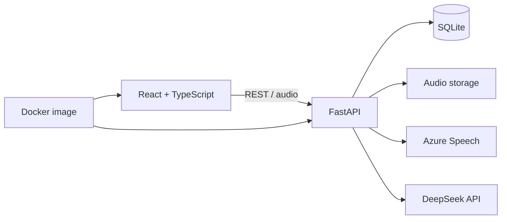

# TOEFL AI Trainer

> A deployed full-stack AI learning application that turns speaking and reading practice into immediate feedback, persisted learning history and targeted review signals.

[**Try the live demo**](https://toefl-listen-repeat.onrender.com/) · [Architecture](docs/ARCHITECTURE.md) · [Deployment notes](docs/DEPLOYMENT.md)

Built with React, TypeScript, FastAPI, SQLite, Azure Speech, DeepSeek and Docker.

> The public demo opens without a shared password. It uses shared third-party API quotas, so AI-intensive features may be temporarily limited.

## Overview

TOEFL AI Trainer is designed around a complete practice loop: attempt, evaluate, review and reinforce. It combines browser audio recording, cloud speech assessment, AI-generated feedback and persistent learning history in one deployable service.

This is an independent training project. It is not affiliated with, endorsed by or an official scoring product of ETS.

## Features

| Module | What it does |
| --- | --- |
| Listen & Repeat | Records spoken responses, requests Azure pronunciation assessment and returns word-level pronunciation, fluency, completeness and prosody diagnostics. |
| Speaking Interview | Guides learners through a four-question interview, transcribes audio and generates structured DeepSeek feedback and reference answers. |
| Reading Practice | Provides short reading sets with answer review and skill-level summaries. |
| Adaptive Reading Simulation | Routes a learner to an Upper or Lower second module from first-module performance, producing a 50-item training path. This is a local simulation, not the official ETS adaptive algorithm. |
| Learning Analytics | Persists attempts, normalized diagnostics and audio references, then builds weak-word, phoneme and review queues from practice history. |

## Architecture



The production container builds the React frontend and serves it together with the FastAPI API. Render provides HTTPS, persistent storage and server-side environment variables.

## What This Project Demonstrates

- Kept API credentials server-side and separated configuration from source code.
- Preserved raw provider responses alongside normalized diagnostics for traceability and debugging.
- Isolated hosted demo data from personal local practice data.
- Implemented optional password-gated access with an HttpOnly session cookie; the portfolio deployment runs in public-demo mode.
- Packaged frontend and backend as one Docker service with a persistent `/data` mount.
- Added content validators for Listen & Repeat, Reading and Speaking Interview banks.

## Privacy and Security

The repository intentionally excludes:

- API keys, access passwords and session secrets;
- personal practice databases and recordings;
- generated audio and local logs;
- machine-specific configuration.

Use `.env.example` only as a configuration template. Never commit a populated `.env` file.

## Run Locally

### Prerequisites

- Python 3.11+
- Node.js 20+
- Azure Speech credentials for pronunciation assessment
- DeepSeek API credentials for AI interview feedback (optional)

### Setup

```bash
git clone https://github.com/desperado74/toefl-listen-repeat.git
cd toefl-listen-repeat

python3 -m venv .venv
source .venv/bin/activate
pip install -r backend/requirements.txt

cp .env.example .env
npm install
npm --prefix frontend install
npm run dev
```

Open `http://127.0.0.1:5173` for local development. Local URLs are development instructions only; the public demo is available from the link at the top of this README.

## Validation

```bash
python data/tools/validate_listen_repeat_bank.py
python data/tools/validate_interview_bank.py
python data/tools/validate_reading_bank.py
npm --prefix frontend run build
python -m compileall backend/app
```

## Deployment

The included `Dockerfile` produces a single service containing the built frontend and FastAPI backend. `render.yaml` defines the hosted service, health check and persistent data paths. Deployment secrets must be configured in the hosting provider rather than committed to Git.

See [Deployment Guide](docs/DEPLOYMENT.md) for the required environment variables and release checklist.

## Project Structure

```text
backend/                 FastAPI application, persistence and scoring logic
frontend/                React and TypeScript client
data/                    Original training content and validation tools
docs/                    Architecture, deployment and content specifications
scripts/                 Optional local development helpers
Dockerfile               Production container build
render.yaml              Render service definition
```

## Current Limitations

- The hosted demo uses shared third-party API quotas, so availability or AI-intensive features may be limited temporarily if quotas are exhausted.
- AI feedback and adaptive routing are training aids, not official TOEFL scores.
- SQLite is appropriate for the current single-service demo; a multi-user production product would require stronger account, storage and rate-limit design.
